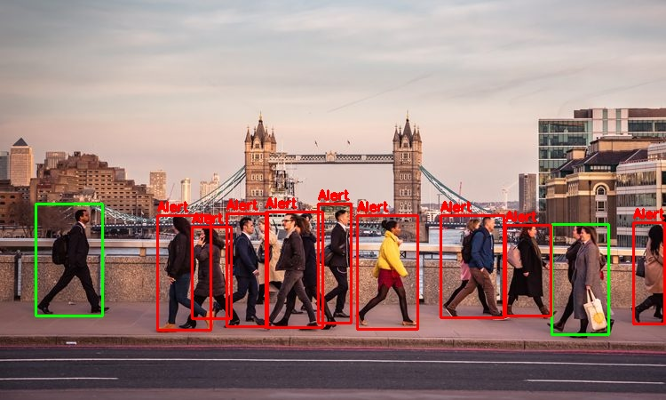

# Social Distance Alert with Convolutional Neural Network

1. Detect the humans in the frame with yolov3 convolutional neural network.
2. Calculate the distance between all the instances of humans detected in the frame.
3. Classify the determined distances as 'Alert' or 'Ok' for social distancing.

## Requirements
1. Numpy
2. Time
3. OpenCV
4. OpenCV_contrib
5. Math

Download yolov3.weights for COCO dataset from this link and add it to the yolov3 directory,
[click here](https://pjreddie.com/darknet/yolo/)

## Steps to run the code

`cd  Social-Distancing-Alert-with-Convolutional-Neural-Network`

To deploy algorithm on images,
`python3 SD_Alert_Image.py`

To deploy algorithm on videos,
`python3 SD_Alert_Video.py`

To deploy algorithm on live streaming webcam,
`python3 SD_Alert_Camera.py`
